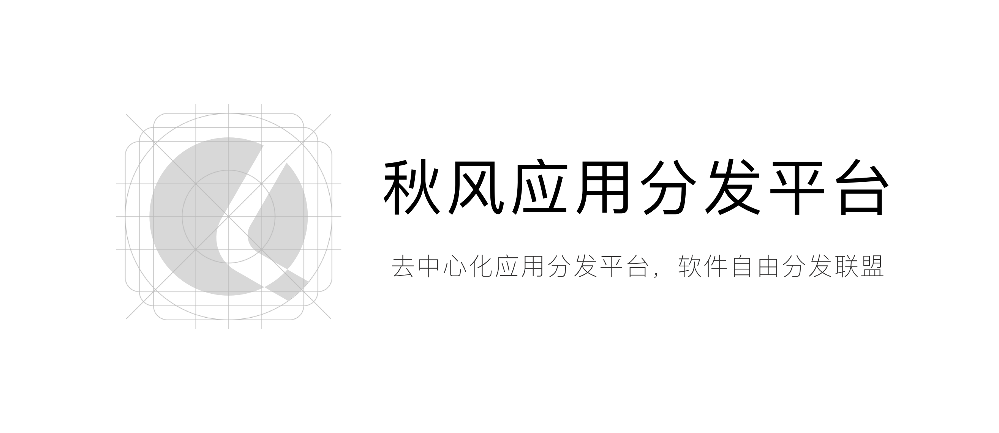

# 秋风开发者联盟官网

> 秋风应用分发平台是一个去中心化应用分发平台，开发团队由一群独立开发者组成。在应用商店垄断软件分发的今天，秋风希望能为独立开发者发出那份属于他们的心声。永远支持开源软件自由分发宣言，这是充满挑战和机遇的世界，欢迎你与我们一起开始改变…

> Qiufeng is a decentralized application distribution platform, and the development team is composed of a group of independent developers.

## 目前计划

-   上线官网
-   开放预约
-   开发应用分发系统
-   内测应用分发系统
-   开发对接 SDK
-   正式上线

## Developers

[@HumorSmith](https://github.com/HumorSmith)
[@xiaohuihuiold](https://github.com/xiaohuihuiold)
[@EndureBlaze](https://github.com/EndureBlaze)
[@fwz233](https://github.com/fwz233)
[@PBK-B](https://github.com/PBK-B)
[@dexfun](https://github.com/dexfun)

## License

The qfrun website framework is open-sourced software licensed under the [MIT license](https://opensource.org/licenses/MIT).
修正
